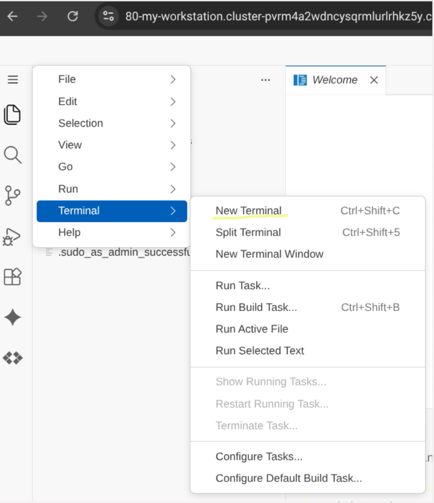

# 🎡 Lab 2: Disneyland Agentic Codelab with Cloud Spanner & BigQuery

In this codelab, you will build a zero-copy federated bridge linking **Cloud Spanner** with **BigQuery**, configure the **Spanner Model Context Protocol (MCP)** server, and use the **Antigravity CLI (`agy`)** to generate an AI-powered pathfinding web application over a Spanner Property Graph.

---

## 🎯 Lab Objectives
* **🏗️ Infrastructure Review**: Peer behind the curtain at the pre-provisioned VPC network, Cloud Workstations, and Cloud Spanner architecture.
* **🎡 Schema & Graph Setup**: Populate Disneyland attractions, connect path routes, and define a native Spanner Property Graph.
* **🌉 Data Federation**: Bridge Spanner with BigQuery to run real-time analytical queries on live ride queues without copy-pasting data.
* **🤖 MCP & Agent Integration**: Hook up the Google-managed Spanner MCP server to provide real-time graph data to your agents.
* **🚀 Agentic Application Building**: Launch the **Antigravity CLI (agy)** to autonomously generate and run a FastAPI + HTML5 pathfinding web app.

---

## 🏗️ Phase 1: Infrastructure Provisioning (Terraform)

The infrastructure is already deployed, if you are interested in the terraform code, you can find it in the [infrastructure](../../infrastructure) directory.

---

## 🗄️ Phase 2: Schema Creation & Data Ingestion

Populate Spanner database **`agent-lab`** with tables and data.

1. Go to the **Cloud Spanner** page in the Google Cloud Console.
2. Click on your Spanner instance **`disneyland`**, and then select database **`agent-lab`**.
3. In the left sidebar, click **Spanner Studio**.
4. Open a new query tab, paste the SQL script below, and click **Run**:

```sql
-- 1. Create DisneylandPark Table
CREATE TABLE DisneylandPark (
  ParkID INT64 NOT NULL,
  Name STRING(255) NOT NULL,
  Location STRING(255) NOT NULL
) PRIMARY KEY (ParkID);

-- 2. Create Attraction Table (with Vector Embedding field)
CREATE TABLE Attraction (
  AttractionID INT64 NOT NULL GENERATED BY DEFAULT AS IDENTITY (BIT_REVERSED_POSITIVE),
  ParkID INT64 NOT NULL,
  Name STRING(255) NOT NULL,
  Land STRING(100) NOT NULL,
  Type STRING(50) NOT NULL,
  Description STRING(MAX),
  Embedding ARRAY<FLOAT32>(vector_length=>768)
) PRIMARY KEY (AttractionID);

ALTER TABLE Attraction ADD CONSTRAINT FK_Park FOREIGN KEY (ParkID) REFERENCES DisneylandPark(ParkID);

-- 3. Create Path Table (for graph routing/navigation)
CREATE TABLE Path (
  SourceAttractionID INT64 NOT NULL,
  TargetAttractionID INT64 NOT NULL,
  DistanceMeters INT64 NOT NULL,
  CONSTRAINT FK_SourceAttraction FOREIGN KEY (SourceAttractionID) REFERENCES Attraction(AttractionID),
  CONSTRAINT FK_TargetAttraction FOREIGN KEY (TargetAttractionID) REFERENCES Attraction(AttractionID)
) PRIMARY KEY (SourceAttractionID, TargetAttractionID);

-- 4. Create the Spanner Property Graph
CREATE OR REPLACE PROPERTY GRAPH DisneylandGraph
  NODE TABLES (
    Attraction
  )
  EDGE TABLES (
    Path
      SOURCE KEY (SourceAttractionID) REFERENCES Attraction (AttractionID)
      DESTINATION KEY (TargetAttractionID) REFERENCES Attraction (AttractionID)
  );

-- 5. Insert DisneylandPark Records
INSERT INTO DisneylandPark (ParkID, Name, Location) VALUES (1, 'Disneyland Park (Paris)', 'Paris, France');
INSERT INTO DisneylandPark (ParkID, Name, Location) VALUES (2, 'Walt Disney Studios Park', 'Paris, France');
INSERT INTO DisneylandPark (ParkID, Name, Location) VALUES (3, 'Disneyland Park (California)', 'Anaheim, USA');
INSERT INTO DisneylandPark (ParkID, Name, Location) VALUES (4, 'Disney California Adventure Park', 'Anaheim, USA');
INSERT INTO DisneylandPark (ParkID, Name, Location) VALUES (5, 'Tokyo Disneyland', 'Tokyo, Japan');

-- 6. Insert Attraction Records

INSERT INTO Attraction (AttractionID, ParkID, Name, Land, Type, Description) VALUES (1, 1, 'Disneyland Railroad Station', 'Main Street, U.S.A.', 'Transport', 'Board a vintage steam train for a scenic journey around the park.');
INSERT INTO Attraction (AttractionID, ParkID, Name, Land, Type, Description) VALUES (2, 1, 'Horse-Drawn Streetcars', 'Main Street, U.S.A.', 'Transport', 'Enjoy a nostalgic ride down Main Street in a turn-of-the-century streetcar.');
INSERT INTO Attraction (AttractionID, ParkID, Name, Land, Type, Description) VALUES (3, 1, 'Main Street Vehicles', 'Main Street, U.S.A.', 'Transport', 'Travel in style aboard a variety of vintage vehicles, like a fire engine or omnibus.');
INSERT INTO Attraction (AttractionID, ParkID, Name, Land, Type, Description) VALUES (4, 1, 'Liberty Arcade', 'Main Street, U.S.A.', 'Walkthrough', 'A covered walkway chronicling the creation of the Statue of Liberty.');
INSERT INTO Attraction (AttractionID, ParkID, Name, Land, Type, Description) VALUES (5, 1, 'Discovery Arcade', 'Main Street, U.S.A.', 'Walkthrough', 'A covered walkway showcasing scale models of futuristic inventions.');
INSERT INTO Attraction (AttractionID, ParkID, Name, Land, Type, Description) VALUES (6, 1, 'Dapper Dans Hair Cuts', 'Main Street, U.S.A.', 'Service', 'An old-fashioned barber shop offering traditional haircuts and shaves.');
INSERT INTO Attraction (AttractionID, ParkID, Name, Land, Type, Description) VALUES (7, 1, 'Big Thunder Mountain', 'Frontierland', 'Thrill Ride', 'A thrilling roller coaster that speeds through a haunted gold-mining town.');
INSERT INTO Attraction (AttractionID, ParkID, Name, Land, Type, Description) VALUES (8, 1, 'Phantom Manor', 'Frontierland', 'Dark Ride', 'A mysterious and spooky tour of a haunted mansion with ghostly residents.');
INSERT INTO Attraction (AttractionID, ParkID, Name, Land, Type, Description) VALUES (9, 1, 'Thunder Mesa Riverboat Landing', 'Frontierland', 'Boat Ride', 'A relaxing cruise on a majestic 19th-century paddle steamer.');
INSERT INTO Attraction (AttractionID, ParkID, Name, Land, Type, Description) VALUES (10, 1, 'Rustler Roundup Shootin Gallery', 'Frontierland', 'Game', 'Test your aim in this Wild West-themed shooting gallery.');
INSERT INTO Attraction (AttractionID, ParkID, Name, Land, Type, Description) VALUES (11, 1, 'Legends of the Wild West', 'Frontierland', 'Walkthrough', 'A scenic path through a frontier fort with encounters of famous Wild West figures.');
INSERT INTO Attraction (AttractionID, ParkID, Name, Land, Type, Description) VALUES (12, 1, 'River Rogue Keelboats', 'Frontierland', 'Boat Ride', 'A rustic keelboat voyage around Big Thunder Mountain and the Wilderness.');
INSERT INTO Attraction (AttractionID, ParkID, Name, Land, Type, Description) VALUES (13, 1, 'Pocahontas Indian Village', 'Frontierland', 'Playground', 'An outdoor play area for children, inspired by Native American culture.');
INSERT INTO Attraction (AttractionID, ParkID, Name, Land, Type, Description) VALUES (15, 1, 'Disneyland Railroad Station', 'Frontierland', 'Transport', 'Board the Disneyland Railroad from the heart of the Wild West.');
INSERT INTO Attraction (AttractionID, ParkID, Name, Land, Type, Description) VALUES (16, 1, 'The Chaparral Theater', 'Frontierland', 'Show', 'A large theater hosting spectacular live stage shows with Disney characters.');
INSERT INTO Attraction (AttractionID, ParkID, Name, Land, Type, Description) VALUES (17, 1, 'Pirates of the Caribbean', 'Adventureland', 'Boat Ride', 'A swashbuckling boat adventure through pirate-infested waters.');
INSERT INTO Attraction (AttractionID, ParkID, Name, Land, Type, Description) VALUES (18, 1, 'Indiana Jones and the Temple of Peril', 'Adventureland', 'Thrill Ride', 'A high-speed mine cart coaster through ancient jungle ruins.');
INSERT INTO Attraction (AttractionID, ParkID, Name, Land, Type, Description) VALUES (19, 1, 'Adventure Isle', 'Adventureland', 'Walkthrough', 'Explore a mysterious island full of caves, suspension bridges, and hidden treasures.');
INSERT INTO Attraction (AttractionID, ParkID, Name, Land, Type, Description) VALUES (20, 1, 'La Cabane des Robinson', 'Adventureland', 'Walkthrough', 'Climb the towering treehouse home of the Swiss Family Robinson.');
INSERT INTO Attraction (AttractionID, ParkID, Name, Land, Type, Description) VALUES (21, 1, 'Le Passage Enchanté dAladdin', 'Adventureland', 'Walkthrough', 'A walkthrough attraction depicting scenes from Disneys Aladdin.');
INSERT INTO Attraction (AttractionID, ParkID, Name, Land, Type, Description) VALUES (22, 1, 'La Plage des Pirates', 'Adventureland', 'Playground', 'A pirate-themed adventure playground for young buccaneers.');
INSERT INTO Attraction (AttractionID, ParkID, Name, Land, Type, Description) VALUES (23, 1, 'Le Château de la Belle au Bois Dormant', 'Fantasyland', 'Icon', 'The iconic Sleeping Beauty Castle, the centerpiece of Disneyland Park.');
INSERT INTO Attraction (AttractionID, ParkID, Name, Land, Type, Description) VALUES (24, 1, 'La Galerie de la Belle au Bois Dormant', 'Fantasyland', 'Walkthrough', 'Discover the story of Sleeping Beauty through stained glass and tapestries inside the castle.');
INSERT INTO Attraction (AttractionID, ParkID, Name, Land, Type, Description) VALUES (25, 1, 'La Tanière du Dragon', 'Fantasyland', 'Walkthrough', 'Venture into the dungeon beneath the castle to find a slumbering dragon.');
INSERT INTO Attraction (AttractionID, ParkID, Name, Land, Type, Description) VALUES (26, 1, 'its a small world', 'Fantasyland', 'Boat Ride', 'A gentle boat ride featuring singing dolls from all corners of the globe.');
INSERT INTO Attraction (AttractionID, ParkID, Name, Land, Type, Description) VALUES (27, 1, 'Peter Pans Flight', 'Fantasyland', 'Dark Ride', 'Soar over London and Never Land in a magical pirate galleon.');
INSERT INTO Attraction (AttractionID, ParkID, Name, Land, Type, Description) VALUES (28, 1, 'Blanche-Neige et les Sept Nains', 'Fantasyland', 'Dark Ride', 'Journey through the story of Snow White and the Seven Dwarfs.');
INSERT INTO Attraction (AttractionID, ParkID, Name, Land, Type, Description) VALUES (29, 1, 'Les Voyages de Pinocchio', 'Fantasyland', 'Dark Ride', 'Follow Pinocchio on his daring journey to become a real boy.');
INSERT INTO Attraction (AttractionID, ParkID, Name, Land, Type, Description) VALUES (30, 1, 'Dumbo the Flying Elephant', 'Fantasyland', 'Family Ride', 'Fly high above Fantasyland on your very own Dumbo.');
INSERT INTO Attraction (AttractionID, ParkID, Name, Land, Type, Description) VALUES (31, 1, 'Le Carrousel de Lancelot', 'Fantasyland', 'Family Ride', 'A classic carousel with beautifully decorated horses.');
INSERT INTO Attraction (AttractionID, ParkID, Name, Land, Type, Description) VALUES (32, 1, 'Mad Hatters Tea Cups', 'Fantasyland', 'Family Ride', 'Spin round and round in a giant teacup at a mad tea party.');
INSERT INTO Attraction (AttractionID, ParkID, Name, Land, Type, Description) VALUES (33, 1, 'Alices Curious Labyrinth', 'Fantasyland', 'Walkthrough', 'Get lost in a whimsical maze inspired by Alice in Wonderland.');
INSERT INTO Attraction (AttractionID, ParkID, Name, Land, Type, Description) VALUES (34, 1, 'Le Pays des Contes de Fées', 'Fantasyland', 'Boat Ride', 'A gentle boat trip through miniature scenes from classic Disney fairy tales.');
INSERT INTO Attraction (AttractionID, ParkID, Name, Land, Type, Description) VALUES (35, 1, 'Casey Jr. – le Petit Train du Cirque', 'Fantasyland', 'Family Ride', 'A charming little circus train that circles Storybook Land.');
INSERT INTO Attraction (AttractionID, ParkID, Name, Land, Type, Description) VALUES (36, 1, 'Disneyland Railroad Station', 'Fantasyland', 'Transport', 'Catch the steam train from the whimsical world of Fantasyland.');
INSERT INTO Attraction (AttractionID, ParkID, Name, Land, Type, Description) VALUES (37, 1, 'Meet Mickey Mouse', 'Fantasyland', 'Meet and Greet', 'Meet the one and only Mickey Mouse backstage at his theater.');
INSERT INTO Attraction (AttractionID, ParkID, Name, Land, Type, Description) VALUES (38, 1, 'Princess Pavilion', 'Fantasyland', 'Meet and Greet', 'Have a royal encounter with a Disney Princess in an enchanted setting.');
INSERT INTO Attraction (AttractionID, ParkID, Name, Land, Type, Description) VALUES (39, 1, 'Le théâtre du Château', 'Fantasyland', 'Show', 'An outdoor stage in front of the castle featuring musical performances.');
INSERT INTO Attraction (AttractionID, ParkID, Name, Land, Type, Description) VALUES (40, 1, 'Star Wars Hyperspace Mountain', 'Discoveryland', 'Thrill Ride', 'A high-speed roller coaster adventure through a Star Wars space battle.');
INSERT INTO Attraction (AttractionID, ParkID, Name, Land, Type, Description) VALUES (41, 1, 'Buzz Lightyear Laser Blast', 'Discoveryland', 'Interactive Ride', 'Help Buzz Lightyear defeat Emperor Zurg in this interactive space shooter.');
INSERT INTO Attraction (AttractionID, ParkID, Name, Land, Type, Description) VALUES (42, 1, 'Orbitron - Machines Volantes', 'Discoveryland', 'Family Ride', 'Pilot your own retro-futuristic spaceship as it orbits a giant planet model.');
INSERT INTO Attraction (AttractionID, ParkID, Name, Land, Type, Description) VALUES (43, 1, 'Star Tours: The Adventures Continue', 'Discoveryland', 'Simulator', 'A thrilling 3D motion-simulated space flight to different Star Wars planets.');
INSERT INTO Attraction (AttractionID, ParkID, Name, Land, Type, Description) VALUES (44, 1, 'Starport', 'Discoveryland', 'Meet and Greet', 'Encounter a mighty character from the Star Wars saga.');
INSERT INTO Attraction (AttractionID, ParkID, Name, Land, Type, Description) VALUES (45, 1, 'Discoveryland Theatre', 'Discoveryland', 'Show', 'A theater presenting seasonal shows and 3D film experiences.');
INSERT INTO Attraction (AttractionID, ParkID, Name, Land, Type, Description) VALUES (46, 1, 'Autopia', 'Discoveryland', 'Family Ride', 'Drive your own futuristic car along a winding track.');
INSERT INTO Attraction (AttractionID, ParkID, Name, Land, Type, Description) VALUES (47, 1, 'Les Mystères du Nautilus', 'Discoveryland', 'Walkthrough', 'Explore Captain Nemos legendary submarine from 20,000 Leagues Under the Sea.');
INSERT INTO Attraction (AttractionID, ParkID, Name, Land, Type, Description) VALUES (48, 1, 'Disneyland Railroad Station', 'Discoveryland', 'Transport', 'The final stop for the Disneyland Railroad, located in the land of tomorrow.');
INSERT INTO Attraction (AttractionID, ParkID, Name, Land, Type, Description) VALUES (49, 1, 'Arcade Alpha & Arcade Bêta', 'Discoveryland', 'Arcade', 'A video game arcade with a mix of classic and modern games.');
INSERT INTO Attraction (AttractionID, ParkID, Name, Land, Type, Description) VALUES (50, 1, 'Videopolis Theatre', 'Discoveryland', 'Show', 'A huge indoor venue for live shows, often with a nearby restaurant.');

-- 7. Insert Path Records

INSERT INTO Path (SourceAttractionID, TargetAttractionID, DistanceMeters) VALUES (1, 2, 70);
INSERT INTO Path (SourceAttractionID, TargetAttractionID, DistanceMeters) VALUES (1, 3, 60);
INSERT INTO Path (SourceAttractionID, TargetAttractionID, DistanceMeters) VALUES (2, 1, 70);
INSERT INTO Path (SourceAttractionID, TargetAttractionID, DistanceMeters) VALUES (2, 4, 80);
INSERT INTO Path (SourceAttractionID, TargetAttractionID, DistanceMeters) VALUES (2, 6, 50);
INSERT INTO Path (SourceAttractionID, TargetAttractionID, DistanceMeters) VALUES (3, 1, 60);
INSERT INTO Path (SourceAttractionID, TargetAttractionID, DistanceMeters) VALUES (3, 5, 80);
INSERT INTO Path (SourceAttractionID, TargetAttractionID, DistanceMeters) VALUES (3, 6, 50);
INSERT INTO Path (SourceAttractionID, TargetAttractionID, DistanceMeters) VALUES (4, 2, 80);
INSERT INTO Path (SourceAttractionID, TargetAttractionID, DistanceMeters) VALUES (4, 6, 40);
INSERT INTO Path (SourceAttractionID, TargetAttractionID, DistanceMeters) VALUES (4, 11, 140);
INSERT INTO Path (SourceAttractionID, TargetAttractionID, DistanceMeters) VALUES (4, 21, 120);
INSERT INTO Path (SourceAttractionID, TargetAttractionID, DistanceMeters) VALUES (5, 3, 80);
INSERT INTO Path (SourceAttractionID, TargetAttractionID, DistanceMeters) VALUES (5, 6, 40);
INSERT INTO Path (SourceAttractionID, TargetAttractionID, DistanceMeters) VALUES (5, 23, 100);
INSERT INTO Path (SourceAttractionID, TargetAttractionID, DistanceMeters) VALUES (5, 42, 100);
INSERT INTO Path (SourceAttractionID, TargetAttractionID, DistanceMeters) VALUES (6, 2, 50);
INSERT INTO Path (SourceAttractionID, TargetAttractionID, DistanceMeters) VALUES (6, 3, 50);
INSERT INTO Path (SourceAttractionID, TargetAttractionID, DistanceMeters) VALUES (6, 4, 40);
INSERT INTO Path (SourceAttractionID, TargetAttractionID, DistanceMeters) VALUES (6, 5, 40);
INSERT INTO Path (SourceAttractionID, TargetAttractionID, DistanceMeters) VALUES (7, 10, 100);
INSERT INTO Path (SourceAttractionID, TargetAttractionID, DistanceMeters) VALUES (7, 12, 60);
INSERT INTO Path (SourceAttractionID, TargetAttractionID, DistanceMeters) VALUES (7, 15, 80);
INSERT INTO Path (SourceAttractionID, TargetAttractionID, DistanceMeters) VALUES (8, 9, 70);
INSERT INTO Path (SourceAttractionID, TargetAttractionID, DistanceMeters) VALUES (8, 11, 90);
INSERT INTO Path (SourceAttractionID, TargetAttractionID, DistanceMeters) VALUES (9, 8, 70);
INSERT INTO Path (SourceAttractionID, TargetAttractionID, DistanceMeters) VALUES (9, 10, 60);
INSERT INTO Path (SourceAttractionID, TargetAttractionID, DistanceMeters) VALUES (10, 7, 100);
INSERT INTO Path (SourceAttractionID, TargetAttractionID, DistanceMeters) VALUES (10, 9, 60);
INSERT INTO Path (SourceAttractionID, TargetAttractionID, DistanceMeters) VALUES (10, 11, 50);
INSERT INTO Path (SourceAttractionID, TargetAttractionID, DistanceMeters) VALUES (11, 4, 140);
INSERT INTO Path (SourceAttractionID, TargetAttractionID, DistanceMeters) VALUES (11, 8, 90);
INSERT INTO Path (SourceAttractionID, TargetAttractionID, DistanceMeters) VALUES (11, 10, 50);
INSERT INTO Path (SourceAttractionID, TargetAttractionID, DistanceMeters) VALUES (12, 7, 60);
INSERT INTO Path (SourceAttractionID, TargetAttractionID, DistanceMeters) VALUES (13, 15, 110);
INSERT INTO Path (SourceAttractionID, TargetAttractionID, DistanceMeters) VALUES (13, 16, 90);
INSERT INTO Path (SourceAttractionID, TargetAttractionID, DistanceMeters) VALUES (15, 7, 80);
INSERT INTO Path (SourceAttractionID, TargetAttractionID, DistanceMeters) VALUES (15, 13, 110);
INSERT INTO Path (SourceAttractionID, TargetAttractionID, DistanceMeters) VALUES (16, 13, 90);
INSERT INTO Path (SourceAttractionID, TargetAttractionID, DistanceMeters) VALUES (16, 17, 150);
INSERT INTO Path (SourceAttractionID, TargetAttractionID, DistanceMeters) VALUES (17, 16, 150);
INSERT INTO Path (SourceAttractionID, TargetAttractionID, DistanceMeters) VALUES (17, 21, 80);
INSERT INTO Path (SourceAttractionID, TargetAttractionID, DistanceMeters) VALUES (17, 22, 60);
INSERT INTO Path (SourceAttractionID, TargetAttractionID, DistanceMeters) VALUES (18, 20, 130);
INSERT INTO Path (SourceAttractionID, TargetAttractionID, DistanceMeters) VALUES (19, 20, 50);
INSERT INTO Path (SourceAttractionID, TargetAttractionID, DistanceMeters) VALUES (19, 22, 70);
INSERT INTO Path (SourceAttractionID, TargetAttractionID, DistanceMeters) VALUES (20, 18, 130);
INSERT INTO Path (SourceAttractionID, TargetAttractionID, DistanceMeters) VALUES (20, 19, 50);
INSERT INTO Path (SourceAttractionID, TargetAttractionID, DistanceMeters) VALUES (20, 22, 40);
INSERT INTO Path (SourceAttractionID, TargetAttractionID, DistanceMeters) VALUES (21, 4, 120);
INSERT INTO Path (SourceAttractionID, TargetAttractionID, DistanceMeters) VALUES (21, 17, 80);
INSERT INTO Path (SourceAttractionID, TargetAttractionID, DistanceMeters) VALUES (21, 22, 50);
INSERT INTO Path (SourceAttractionID, TargetAttractionID, DistanceMeters) VALUES (22, 17, 60);
INSERT INTO Path (SourceAttractionID, TargetAttractionID, DistanceMeters) VALUES (22, 19, 70);
INSERT INTO Path (SourceAttractionID, TargetAttractionID, DistanceMeters) VALUES (22, 20, 40);
INSERT INTO Path (SourceAttractionID, TargetAttractionID, DistanceMeters) VALUES (22, 21, 50);
INSERT INTO Path (SourceAttractionID, TargetAttractionID, DistanceMeters) VALUES (22, 28, 160);
INSERT INTO Path (SourceAttractionID, TargetAttractionID, DistanceMeters) VALUES (23, 5, 100);
INSERT INTO Path (SourceAttractionID, TargetAttractionID, DistanceMeters) VALUES (23, 24, 20);
INSERT INTO Path (SourceAttractionID, TargetAttractionID, DistanceMeters) VALUES (23, 25, 30);
INSERT INTO Path (SourceAttractionID, TargetAttractionID, DistanceMeters) VALUES (23, 31, 60);
INSERT INTO Path (SourceAttractionID, TargetAttractionID, DistanceMeters) VALUES (24, 23, 20);
INSERT INTO Path (SourceAttractionID, TargetAttractionID, DistanceMeters) VALUES (25, 23, 30);
INSERT INTO Path (SourceAttractionID, TargetAttractionID, DistanceMeters) VALUES (26, 34, 70);
INSERT INTO Path (SourceAttractionID, TargetAttractionID, DistanceMeters) VALUES (26, 38, 80);
INSERT INTO Path (SourceAttractionID, TargetAttractionID, DistanceMeters) VALUES (26, 45, 180);
INSERT INTO Path (SourceAttractionID, TargetAttractionID, DistanceMeters) VALUES (27, 28, 40);
INSERT INTO Path (SourceAttractionID, TargetAttractionID, DistanceMeters) VALUES (27, 31, 50);
INSERT INTO Path (SourceAttractionID, TargetAttractionID, DistanceMeters) VALUES (28, 22, 160);
INSERT INTO Path (SourceAttractionID, TargetAttractionID, DistanceMeters) VALUES (28, 27, 40);
INSERT INTO Path (SourceAttractionID, TargetAttractionID, DistanceMeters) VALUES (28, 29, 40);
INSERT INTO Path (SourceAttractionID, TargetAttractionID, DistanceMeters) VALUES (29, 28, 40);
INSERT INTO Path (SourceAttractionID, TargetAttractionID, DistanceMeters) VALUES (29, 30, 40);
INSERT INTO Path (SourceAttractionID, TargetAttractionID, DistanceMeters) VALUES (30, 29, 40);
INSERT INTO Path (SourceAttractionID, TargetAttractionID, DistanceMeters) VALUES (30, 31, 60);
INSERT INTO Path (SourceAttractionID, TargetAttractionID, DistanceMeters) VALUES (31, 23, 60);
INSERT INTO Path (SourceAttractionID, TargetAttractionID, DistanceMeters) VALUES (31, 27, 50);
INSERT INTO Path (SourceAttractionID, TargetAttractionID, DistanceMeters) VALUES (31, 30, 60);
INSERT INTO Path (SourceAttractionID, TargetAttractionID, DistanceMeters) VALUES (32, 33, 50);
INSERT INTO Path (SourceAttractionID, TargetAttractionID, DistanceMeters) VALUES (33, 32, 50);
INSERT INTO Path (SourceAttractionID, TargetAttractionID, DistanceMeters) VALUES (33, 37, 90);
INSERT INTO Path (SourceAttractionID, TargetAttractionID, DistanceMeters) VALUES (34, 26, 70);
INSERT INTO Path (SourceAttractionID, TargetAttractionID, DistanceMeters) VALUES (34, 35, 50);
INSERT INTO Path (SourceAttractionID, TargetAttractionID, DistanceMeters) VALUES (35, 34, 50);
INSERT INTO Path (SourceAttractionID, TargetAttractionID, DistanceMeters) VALUES (35, 36, 60);
INSERT INTO Path (SourceAttractionID, TargetAttractionID, DistanceMeters) VALUES (36, 35, 60);
INSERT INTO Path (SourceAttractionID, TargetAttractionID, DistanceMeters) VALUES (36, 37, 70);
INSERT INTO Path (SourceAttractionID, TargetAttractionID, DistanceMeters) VALUES (37, 33, 90);
INSERT INTO Path (SourceAttractionID, TargetAttractionID, DistanceMeters) VALUES (37, 36, 70);
INSERT INTO Path (SourceAttractionID, TargetAttractionID, DistanceMeters) VALUES (38, 26, 80);
INSERT INTO Path (SourceAttractionID, TargetAttractionID, DistanceMeters) VALUES (38, 39, 40);
INSERT INTO Path (SourceAttractionID, TargetAttractionID, DistanceMeters) VALUES (39, 38, 40);
INSERT INTO Path (SourceAttractionID, TargetAttractionID, DistanceMeters) VALUES (39, 41, 130);
INSERT INTO Path (SourceAttractionID, TargetAttractionID, DistanceMeters) VALUES (40, 43, 90);
INSERT INTO Path (SourceAttractionID, TargetAttractionID, DistanceMeters) VALUES (40, 47, 50);
INSERT INTO Path (SourceAttractionID, TargetAttractionID, DistanceMeters) VALUES (41, 39, 130);
INSERT INTO Path (SourceAttractionID, TargetAttractionID, DistanceMeters) VALUES (41, 42, 60);
INSERT INTO Path (SourceAttractionID, TargetAttractionID, DistanceMeters) VALUES (41, 50, 70);
INSERT INTO Path (SourceAttractionID, TargetAttractionID, DistanceMeters) VALUES (42, 5, 100);
INSERT INTO Path (SourceAttractionID, TargetAttractionID, DistanceMeters) VALUES (42, 41, 60);
INSERT INTO Path (SourceAttractionID, TargetAttractionID, DistanceMeters) VALUES (42, 43, 70);
INSERT INTO Path (SourceAttractionID, TargetAttractionID, DistanceMeters) VALUES (43, 40, 90);
INSERT INTO Path (SourceAttractionID, TargetAttractionID, DistanceMeters) VALUES (43, 42, 70);
INSERT INTO Path (SourceAttractionID, TargetAttractionID, DistanceMeters) VALUES (43, 44, 30);
INSERT INTO Path (SourceAttractionID, TargetAttractionID, DistanceMeters) VALUES (44, 43, 30);
INSERT INTO Path (SourceAttractionID, TargetAttractionID, DistanceMeters) VALUES (45, 26, 180);
INSERT INTO Path (SourceAttractionID, TargetAttractionID, DistanceMeters) VALUES (45, 50, 40);
INSERT INTO Path (SourceAttractionID, TargetAttractionID, DistanceMeters) VALUES (46, 48, 100);
INSERT INTO Path (SourceAttractionID, TargetAttractionID, DistanceMeters) VALUES (47, 40, 50);
INSERT INTO Path (SourceAttractionID, TargetAttractionID, DistanceMeters) VALUES (48, 46, 100);
INSERT INTO Path (SourceAttractionID, TargetAttractionID, DistanceMeters) VALUES (48, 49, 60);
INSERT INTO Path (SourceAttractionID, TargetAttractionID, DistanceMeters) VALUES (49, 48, 60);
INSERT INTO Path (SourceAttractionID, TargetAttractionID, DistanceMeters) VALUES (49, 50, 50);
INSERT INTO Path (SourceAttractionID, TargetAttractionID, DistanceMeters) VALUES (50, 41, 70);
INSERT INTO Path (SourceAttractionID, TargetAttractionID, DistanceMeters) VALUES (50, 45, 40);
INSERT INTO Path (SourceAttractionID, TargetAttractionID, DistanceMeters) VALUES (50, 49, 50);
```

---

## 🌉 Phase 3: Real-Time Bridge Verification Query

Verify the zero-copy federated bridge by querying Spanner tables directly from BigQuery Studio:

1. Open **BigQuery Studio** in the Google Cloud Console.
2. In the left **Explorer** panel, expand your project to locate the mapped **`disneyland_spanner_external`** dataset.
3. Open a new SQL tab, paste the following query (replace `YOUR_PROJECT_ID`), and click **Run**:

```sql
SELECT * 
FROM `YOUR_PROJECT_ID.disneyland_spanner_external.Attraction` 
LIMIT 5;
```

---

## 🎛️ Phase 4: Model Context Protocol (MCP) Agent Registry Verification

Spanner is automatically registered as a Google-managed MCP Server in the Gemini Agent Platform (formerly VertexAI) **Agent Registry** once active.

To verify the registry connection:
* Check [Managed MCP Servers](https://console.cloud.google.com/agent-platform/agent-registry/mcp-servers) in the Cloud Console.
* Or run this gcloud command in your terminal:
  ```bash
  gcloud alpha agent-registry mcp-servers list \
    --location=global \
    --format=json
  ```
  *(Confirm a Spanner entry is present in the output).*

> [!NOTE]
> If prompted in either the console or terminal to enable the **Agent Registry API** (`agentregistry.googleapis.com`), proceed and enable it.

---

## 🚀 Phase 5: Building the Agentic Application

Use the **Antigravity CLI (agy)** in your Cloud Workstation to generate a complete web app (FastAPI backend and HTML5 frontend) that leverages **Spanner Graph** pathfinding.

### 📂 1. Open the Project Folder & Terminal in Cloud Workstations

1. Launch your workstation instance from the Cloud Workstations page.
2. In the editor, select **File** -> **Open Folder**, enter `/home/user/labs/lab02_spanner_disneyland`, and click **OK**.
3. Open a terminal by selecting **Terminal** -> **New Terminal** (or press `Ctrl+Shift+C`).



---

### 🔑 2. Authenticate the Terminal & Set Active Project

Authenticate both the `gcloud` CLI and Application Default Credentials (ADC) if they are not already set:

```bash
# Checks if authenticated; if not, triggers the login flow
if [ -z "$(gcloud config get-value account 2>/dev/null)" ] || [ ! -f ~/.config/gcloud/application_default_credentials.json ]; then gcloud auth login --update-adc; fi
```
*(If prompted, sign in using your Google account and paste the authorization code into the terminal).*

Then, set your active project:

```bash
gcloud config set project <YOUR_PROJECT_ID>
```
*(Replace `<YOUR_PROJECT_ID>` with your assigned project ID, e.g. `dataforge26krk-6701`).*

---

> [!IMPORTANT]
> **Two Authentication Flows**:
> 1. **Terminal / ADC (`gcloud auth login --update-adc`)**: Enables python scripts and MCP tools to access Spanner and Vertex AI.
> 2. **Antigravity CLI (`agy`)**: Authenticates your developer session using your assigned Google Cloud project ID.

### ⚙️ 3. Initialize the Antigravity CLI

Navigate to the lab directory and launch the CLI with permissions auto-approved:
```bash
cd ~/labs/lab02_spanner_disneyland
agy --dangerously-skip-permissions
```

> [!TIP]
> The `--dangerously-skip-permissions` flag bypasses all interactive tool confirmation prompts, allowing `agy` to research, plan, and write code continuously without pausing for manual approvals.

When running `agy` for the first time, select **2. Use a Google Cloud project** as the login method:


Enter your assigned project ID (e.g. `dataforge26krk-6701`).

Verify MCP connectivity:
* Type `/mcp` in `agy` to ensure the Google-managed Spanner MCP server displays connected.

---

### 🎯 4. Prompting Antigravity to Generate the Agentic Application

Paste the following developer prompt into the active `agy` CLI session:

> [!NOTE]
> **Generation Flow**: The agent performs codebase research, generates `implementation_plan.md` for your approval, and then implements the backend, frontend, and startup scripts.

```text
Goal: Build a high-performance, beautiful Disneyland Navigator application.
Stack & Architecture:
- Backend: FastAPI Python service (app.py) serving REST endpoints and the single-page frontend at root ('/').
- Frontend: Single-page HTML5/JS application (index.html) with Tailwind CSS via CDN and Vis.js for network graph visualization.
- Infrastructure Context: Cloud Spanner instance "disneyland", database "agent-lab", property graph "DisneylandGraph".

Backend Specifications (app.py):
- Enable CORSMiddleware with allow_origins=["*"].
- Serve index.html at GET '/' using FastAPI's FileResponse or HTMLResponse.
- Use google-cloud-spanner Python SDK for direct data endpoints:
  - GET /api/attractions: Queries all attraction nodes (id, name, zone, type) from Spanner.
  - GET /api/paths: Queries all walkway edges (source, target, distance) from Spanner 'Path' table.
  - POST /api/navigate: Takes source and destination attraction IDs. Fetches candidate graph paths using Spanner Graph MATCH query (or edges) and computes the optimal shortest route. Returns { "path": [...], "total_distance": N, "spanner_query": "..." }.
- Use google-adk Python SDK for conversational endpoint:
  - POST /api/chat: Invokes the Disneyland Agent configured with the Google-managed Spanner MCP server (Gemini Agent Platform registry, location: global, model: gemini-3.8-flash) to answer park questions. Returns { "response": "...", "queries_executed": [...] }.

Frontend Specifications (index.html):
- Theme: Premium glassmorphic interface, deep navy background (#0b1120), sparkling royal gold accents (#f59e0b), smooth hover micro-animations.
- Components:
  - Interactive Route Finder: Dropdowns for Start and End attractions, a "Find Route" button, and distance breakdown card.
  - Vis.js Graph Canvas: Loads real nodes from /api/attractions and edges from /api/paths on startup. When a route is found, highlights route nodes/edges in radiant gold/emerald and dims background nodes/edges.
  - Chat Terminal: Collapsible or side-drawer chat window communicating with /api/chat.
  - "View Queries" Inspector: Top-right button opening a modal/panel displaying the raw Spanner SQL and GQL queries executed by the last action.

Startup & Validation (setup.sh):
- Automated bash script that detects and activates existing 'venv' if present (otherwise creates one), ensures dependencies (fastapi, uvicorn, google-cloud-spanner, google-adk) are installed, runs app.py via uvicorn on 0.0.0.0:8000, and opens http://localhost:8000.

Instructions for Agent:
1. Research existing custom skills in `.agents/skills/` (`spanner-graph` and `vertex-config`) and verify Spanner database schema before coding.
2. Produce implementation_plan.md for approval.
3. Write app.py, index.html, and setup.sh.
```

---

### 🧩 5. Understanding the `agy` CLI Development Workflow

The agent operates in three distinct phases:
1. **Planning (Implementation Plan)**: The agent creates an architecture plan (`implementation_plan.md`) for your review. If auto-approve is off, type `yes` to proceed.
2. **Execution**: The agent writes the backend FastAPI app (`app.py`), the frontend client (`index.html`), and a startup script (`setup.sh`).
3. **Walkthrough**: The agent outputs a final `walkthrough.md` report explaining the generated components.

> [!IMPORTANT]
> **Known Limitation: File Links in Terminals**:
> Clicking terminal links (like `[implementation_plan.md](...)`) may not open them in browser-based Cloud Workstations. Instead, use **File** -> **Open File...** (or `Ctrl+O`) in Code-OSS and enter the path displayed in your `agy` CLI output.

---

### 💻 6. Run and Explore the Application

Once the agent completes the code generation:

1. **Start the Server**: In your terminal, run `bash setup.sh` to install dependencies and start FastAPI.
   
   > [!TIP]
   > **Accessing Port 8000**:
   > Code-OSS will automatically detect the open port and show a popup in the bottom right corner. Click **Open in Browser** to launch the live dashboard.

2. **Check Spanner Graph**: Explore the generated property graph schema in the Google Cloud Console under **Cloud Spanner Studio**.
3. **Inspect the Code**: Open `app.py` in Code-OSS to review how the backend queries Spanner and uses the `google-adk` SDK.
4. **Ask for Clarification**: You can ask questions about the generated code directly in your active `agy` CLI session (e.g., *"Explain how the pathfinding endpoint works"*).

---

### 🧭 7. Deep Dive: Spanner Graph Queries under the Hood

The agent uses native **Spanner Graph** queries (via the `GRAPH_TABLE` function) to traverse the property graph. For example:

```sql
SELECT * 
FROM GRAPH_TABLE(DisneylandGraph
  MATCH p = (src:Attraction {Name: 'Phantom Manor'})
        -[:Path]->{1,5}(dest:Attraction {Name: 'Big Thunder Mountain'})
  RETURN 
    src.Name AS Source, 
    dest.Name AS Target, 
    (SELECT SUM(e.DistanceMeters) FROM UNNEST(edges(p)) AS e) AS TotalDistanceMeters
);
```

This zero-copy graph traversal avoids the overhead of syncing data to a separate graph database or building custom traversal algorithms in application code.

---

## 🎢 Phase 6: Challenge Task — Dynamic Pricing, Attraction Executions & Live Leaderboard

Welcome to the competitive park simulation! In this phase, you will extend Disneyland's data model to simulate live attraction execution runs, track ticket revenue, and optimize pricing under economic demand constraints.

The global hackathon admin leaderboard continuously monitors your Spanner database and awards team points for DDL completion, data throughput, and optimized park revenue.

### 1. Execute Spanner Schema Extension (DDL)

Open **Spanner Studio** in your database `agent-lab` and run the following DDL script:

```sql
-- =============================================================================
-- Phase 6 Challenge: Attraction Executions & Dynamic Pricing Engine
-- =============================================================================

CREATE TABLE AttractionRun (
  AttractionID INT64 NOT NULL,
  RunID INT64 NOT NULL GENERATED BY DEFAULT AS IDENTITY (BIT_REVERSED_POSITIVE),
  RunTimestamp TIMESTAMP NOT NULL OPTIONS (allow_commit_timestamp = true),
  TicketPrice NUMERIC NOT NULL,
  CONSTRAINT Chk_TicketPrice CHECK (TicketPrice >= 0)
) PRIMARY KEY (AttractionID, RunID),
  INTERLEAVE IN PARENT Attraction ON DELETE CASCADE;

-- Secondary covering index for rapid time-series analysis & dashboard queries
CREATE INDEX Idx_AttractionRun_Timestamp 
  ON AttractionRun (RunTimestamp DESC) 
  STORING (TicketPrice);
```

> [!TIP]
> **Spanner Best Practices Applied**:
> * **Interleaving**: Child `AttractionRun` records are stored physically adjacent to their parent `Attraction` row on the same split, enabling zero-network-hop local joins.
> * **Bit-Reversed Identity**: Primary key `RunID` avoids write hotspotting during high-concurrency simulation and load testing.
> * **TrueTime Commit Timestamp**: Server-authoritative timestamps using `PENDING_COMMIT_TIMESTAMP()`.
> * **NUMERIC & Covering Index**: Financial fields use exact numeric precision, and `STORING (TicketPrice)` enables index-only scans for price and revenue evaluation.

### 2. The Disneyland Economic Intelligence

The central event leaderboard evaluates your park revenue based on real-world **price elasticity**:
* **Theme Park Reality**: High prices yield higher profit margins per visitor, but attendance drops off steeply. Low prices pack the ride queues, but low margins fail to generate meaningful profits.
* **Market Guidance**: Historical data shows most successful attractions operate within a realistic price window of **`$10.00` to `$30.00`**.
* **Beware the Extremes**:
  * Setting prices too aggressively high empties the queues (*Luxury Trap* badge).
  * Discounting too heavily leaves massive money on the table (*Bargain Basement* badge).
* **The Challenge**: Prompt your AI agent to reason about capacity, throughput, and elasticity to find the optimal pricing equilibrium that maximizes total park revenue!

### 3. Prompt `agy` in your Workstation VM to Build & Run a High-Throughput Load Test

Switch to your **Cloud Workstation terminal** (in Code-OSS) and launch the **Antigravity CLI (`agy`)** to generate and execute a multi-threaded Spanner load test script against your baseline instance (configured with default 100 PUs):

```bash
agy --dangerously-skip-permissions "Create and execute a high-throughput multi-threaded Python load test script (spanner_load_test.py) for Cloud Spanner that simulates Disneyland attraction runs. 
The script should:
1. Connect to Spanner instance 'disneyland' and database 'agent-lab' using google-cloud-spanner.
2. Read the existing Attraction IDs from the 'Attraction' table.
3. Accept command-line arguments: --threads (default 8), --batch-size (default 100, capped at 500 to respect Spanner transaction limits), and --duration-seconds (default 90).
4. Pick optimal ticket prices within the realistic $10.00 to $30.00 market window to maximize park gross revenue under price elasticity.
5. In parallel worker threads, commit AttractionRun records using batch mutations with PENDING_COMMIT_TIMESTAMP(), including error handling and exponential backoff for transient gRPC errors.
6. Benchmark sustained write throughput (runs/sec) and commit latency. Execute the script with --duration-seconds 90. If write latency climbs or CPU saturates, advise the operator on compute scaling—do NOT execute instance updates or modify processing units automatically."
```

With `--dangerously-skip-permissions`, `agy` will generate the implementation plan, write `spanner_load_test.py`, and execute the baseline 90-second run autonomously with the initial 100 PUs.

### 4. Monitor Spanner Health & Watch the Global Leaderboard

During and immediately following your baseline load test:

1. Check your Spanner CPU and latency in the Google Cloud Console under **Cloud Spanner > disneyland > Monitoring**.
2. Look at the live event projector screen running the **Global Disneyland Leaderboard** to see:
   * Your **City Ranking** (Tokyo, London, Paris, etc.).
   * Your total park **Gross Revenue ($)** calculated live.
   * Your **Compute Power (PUs)** and **Write Ingestion Throughput (Runs/sec)**.
   * Your **Spanner CPU %** gauge.
   * Special badges unlocked:
     * 🏰 **Castle Architect** (Complete DDL & Graph)
     * 💰 **Disney Tycoon** (Top revenue generator)
     * ⚡ **Hyperscale Operator** (Scaled compute to $\ge$ 500 PUs)
     * 🚀 **Throughput Titan** (Sustained write velocity $\ge$ 100 runs/sec)
     * 🔥 **Spanner Meltdown** (Peak load stress tester)

### 5. Lesson Learned: The Park Architect's Dilemma — Vertical Scaling (Throughput vs. CPU Meltdown)

Now that you have run your initial load test against the baseline instance, evaluate the observed performance:

* **The Baseline Bottleneck**: By default, your `disneyland` Spanner instance is provisioned with **100 Processing Units (PUs)** (0.1 Node). Under multi-threaded concurrent ingestion, 100 PUs saturate rapidly at 100% CPU. When saturated, Spanner queues incoming requests, write latencies spike, throughput plateaus, and you likely triggered the **🔥 Spanner Meltdown** badge on the leaderboard.
* **The Scaling Lever (Vertical Scaling)**: In Cloud Spanner, compute capacity can be scaled vertically on-the-fly with zero downtime, zero data repartitioning delays, and without dropping database connections. If your city's **Runs/sec** plateaus or CPU turns red, your park needs more compute capacity.
* **Step 1: Vertically Scale Spanner PUs**:
  Run this command in your terminal to scale your instance compute capacity (e.g., to 500 or 1000 PUs):
  ```bash
  # Scale your instance to 500 or 1000 PUs for high-throughput ingestion
  gcloud spanner instances update disneyland --processing-units=500
  ```
* **Step 2: Re-Run Load Test with Higher Concurrency**:
  With 500+ PUs provisioned, re-run the Python load test script with increased concurrency to saturate the new capacity:
  ```bash
  python3 spanner_load_test.py --threads 16 --duration-seconds 90
  ```

> [!TIP]
> **Leaderboard Strategy**: The central dashboard tracks both your **Compute Capacity (PUs)** and **Direct Write Throughput (Runs/sec)**. Scaling beyond the baseline awards bonus points and unlocks the **⚡ Hyperscale Operator** ($\ge$ 500 PUs) and **🚀 Throughput Titan** ($\ge$ 100 runs/sec) badges!

---

## 🔧 Phase 7: Pro-Tips & Advanced Extensions

* **📊 Architecture Visualization (PlantUML)**: Ask `agy` to generate a PlantUML sequence diagram showing request flow from frontend to Spanner (`agy "Generate a PlantUML sequence diagram for our app"`).
* **🔍 In-Database Vector Embeddings & Semantic Search**:
  Notice that the initial data ingestion in Phase 2 left `Attraction.Embedding` unpopulated (`NULL`). Before running vector searches, you must generate embeddings for attraction descriptions. Cloud Spanner natively supports [in-database embedding generation and backfills](https://cloud.google.com/spanner/docs/backfill-embeddings) via remote Vertex AI model integration, eliminating the need to pull raw text into client applications.

  Using the multilingual embedding model [`text-multilingual-embedding-002`](https://cloud.google.com/gemini-enterprise-agent-platform/models/embeddings/get-text-embeddings) (768 dimensions), you can register a Spanner `MODEL` and execute backfills directly inside Spanner SQL.

  > [!TIP]
  > **Sample Prompt: Ask `agy` to Backfill Embeddings**:
  > Switch to your Cloud Workstation terminal and ask `agy` to generate and run the in-database embedding backfill:
  >
  > ```bash
  > agy "Generate and execute Spanner SQL to backfill vector embeddings for the Disneyland attractions in database 'agent-lab':
  > 1. Check table 'Attraction'. If 'Embedding' has a dimension other than 768, alter it with:
  >    ALTER TABLE Attraction ALTER COLUMN Embedding ARRAY<FLOAT32>(vector_length=>768);
  > 2. Register the remote embedding model in Spanner:
  >    CREATE OR REPLACE MODEL TextMultilingualEmbedding
  >    INPUT(content STRING(MAX))
  >    OUTPUT(embeddings STRUCT<values ARRAY<FLOAT32>>)
  >    REMOTE OPTIONS (
  >      endpoint = '//aiplatform.googleapis.com/projects/<YOUR_PROJECT_ID>/locations/<YOUR_REGION>/publishers/google/models/text-multilingual-embedding-002',
  >      default_batch_size = 5
  >    );
  > 3. Execute an UPDATE statement using ML.PREDICT to backfill Attraction.Embedding from Attraction.Description for all rows where Embedding IS NULL.
  > 4. Test the generated embeddings with a semantic similarity query finding the top 5 attractions matching 'spooky haunted mansion and ghosts'."
  > ```

  **Manual Spanner Studio Query (Alternative)**:
  Once the model and embeddings are backfilled, run semantic similarity queries directly in **Spanner Studio** using native `COSINE_DISTANCE`:
  ```sql
  -- Find attractions semantically similar to a user query
  SELECT AttractionID, Name, Land, Type, Description
  FROM Attraction
  WHERE Embedding IS NOT NULL
  ORDER BY COSINE_DISTANCE(
    Embedding,
    (SELECT embeddings.values 
     FROM ML.PREDICT(
       MODEL TextMultilingualEmbedding, 
       (SELECT 'thrilling wild west gold mine roller coaster' AS content)
     ))
  ) ASC
  LIMIT 5;
  ```
* **⚡ Lock Contention Diagnostics**: If seeing write timeouts under heavy load, check Spanner lock contention:
  ```sql
  SELECT * FROM SPANNER_SYS.LOCK_STATS_TOP_10MINUTE;
  ```

---

## 🧹 Clean Up

> [!WARNING]
> **Ongoing Costs**: If running in your own GCP project, destroy all resources when finished to avoid charges:
> ```bash
> terraform destroy
> ```
